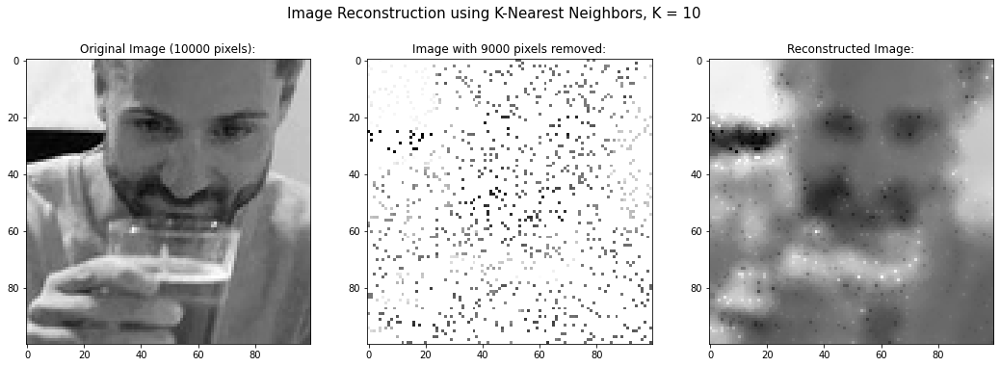
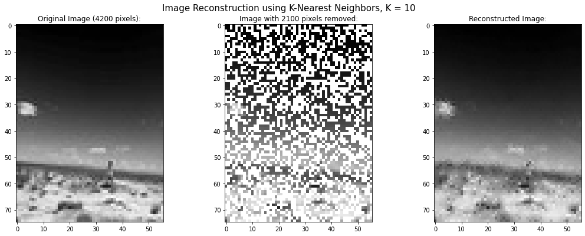
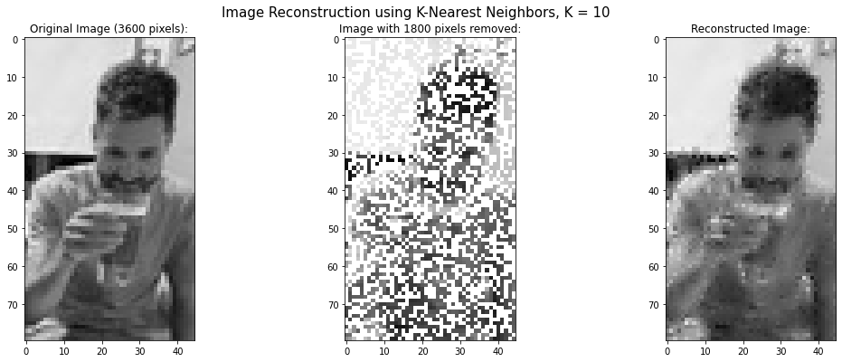
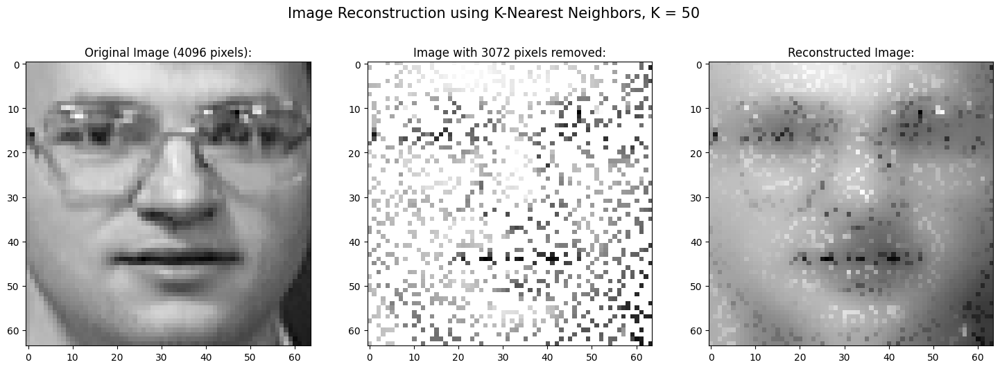

## KNN Image Reconstruction 

This was a group project! Credit is due to: Nick Barnes, Gaurav, Patrick Gilfether. 

### What is it? 

This is an implementation of the K-nearest neighbors algorithm for image reconstruction. In brief this program takes in an image (ideally low resolution, unless you have the patience of a god or the computing resources of a god-like entity), knocks out some preset percentage of pixels, and then "reconstructs" the image, filling in the missing pixels by taking a weighted average of the K (a value which can be adjusted)-nearest existing pixels. 


### Results



KNN does surprisingly on very little data, like here with 90% of the pixels removed. 

The final product should be graded on a curve. Consider **1)** just the simplicity in how it was put back together, and **2)** how a person might do if given that middle image, a few hours, and some art supplies.




It also did okay at least recognizing the locations of the items in this landscape, like the clouds, person, and rocks in the foreground (50% pixels removed). 



Along with varying the percentage of pixels removed, the other variable of interest is K: how many neighbors. 



If K is arbitrarily high, eventually you're replacing empty pixels with something closer to an averaged pixel value for the whole image. Things get blurry. 


If K is 1, you're arbitrarily grabbing very specific data and weighting it way too heavily. Things get blocky. 

### How to run

This project was made in a google Colab .ipynb notebook environment, and still runs best there (imo). You can get there by this [link](https://colab.research.google.com/drive/1osKgkQqXICLf7xR8yOvauopszEaeksXm?usp=sharing) or if that's a dead link by now the .ipynb notebook is also copied to this repo.

I really don't even know why I went to the trouble (not that it was much trouble) of making it a .py file, but I did. 

You can run it locally with the following command: 

```commandline
python3 ./main.py
```

To test it consider using 10x10_face.png in the 'lowres' folder (as in, low resolution images). 

In general this whole thing works best with small images. It's value (imo) is as an educational tool to gain some intuition around KNN. 


